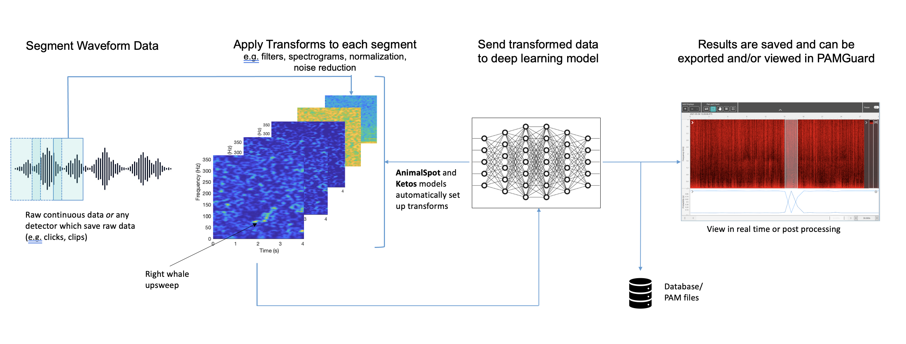
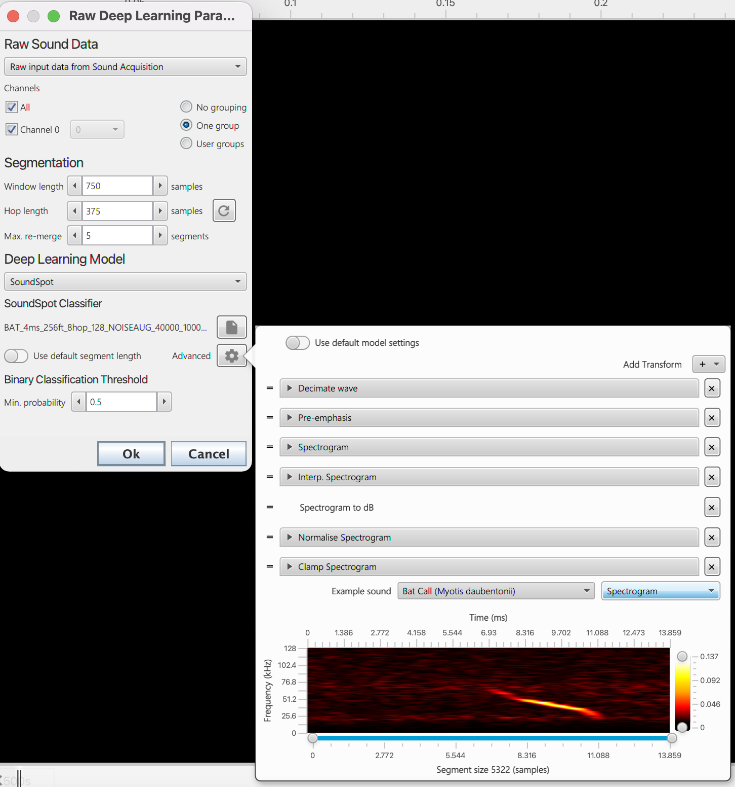
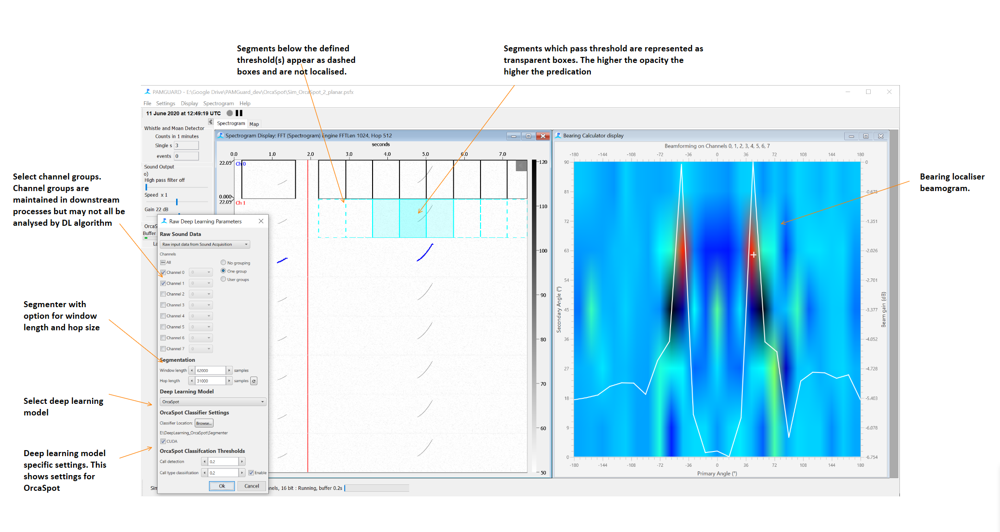

## Still in beta - the module will be available for use soon ##

# PAMGuard_DeepLearningSegmenter
The Deep Learning Segment PAMGuard module acquires incoming chunks of raw sound data and sends to a deep learning model for classification in real time. Results become part of the PAMGuard processing chain and so can be further classified, saved as raw wav clips, localised, annotated etc. 

## Introduction 
[PAMGuard](https://www.pamguard.org/) is a bioacoustics toolbox for the detection, classification and localisation of soniferous species both in real time and post processing sound files. It's primarily focused cetaceans (whales, dolphins, river dolphins, porpoises) and bats however can be used with any vocalising animal. The modular structure of PAMGuard allows users to create processing chains for detection, classification and localisation which is combined with a comprehensive data management and visualisation system. This allows users to analyse and then visualise and navigate through months and years of acoustic recordings. 

So far PAMGuard has mainly used more traditional detection and classification algorithms (e.g. energy detectors) and some machine learning approaches (e.g. whistle classifier, ROCCA), however, has yet to fully integrate deep learning. The powerful data visualisation tools and real time capability of PAMGuard mean it is an ideal platform to integrate deep learning classifiers. Such algorithms greatly enhance automated classification performance and, if combined with PAMGuard, could be integrated into an acoustic analysis workflow with a wide variety of conservation applications, for example, improving real time mitigation and enabling more streamlined analysis of large acousitc datasets. This plugin PAMGuard module provdes a framework to integrate deep learning classifiers which analyse any detection or data stream that can provide raw data. That means it works on continious sound data, clips, clicks or other data that holds a raw waveform. 

## Frameworks and Models
The structure of the module is as follows. 

1) Data segmentation: here raw sound data is segmented into chunks with a specified chunk and hop size.
2) Data transforms: the chunks are sent to a list of data transforms that convert the raw wave data to an input acceptable for the model
3) The deep learning model: passes the transformed data to the model and waits for a result.
4) Data packaging: packages the results into a data unit which is passed onto PAMGuard's displays and downstream processes.

<p align="center">
  
</p>

_A diagram of how the deep learning module works in PAMGuard. An input waveform is segmented into chunks. A series of transforms are applied to each chunk creating the input for the deep learning model. The transformed chunks are sent to the model. The results from the model are saved and can be viewed in real time (e.g. mitigation) or in post processing (e.g. data from SoundTraps)._

The module is based on AWS's [deep java library (djl)](https://djl.ai/) and [JPAM](https://github.com/macster110/jpam) which does most of the heavy lifting loading and runnng models and is model independent i.e. you can use models trained in PyTorch, Tensorflow etc. The main job of the PAMGuard module is therefore to convert the raw sound data into a format suitable for a loaded model and provide a user interface. The deep learning module is designed primarily to work with existing model frameworks - i.e. used in conjuction with libraries that are used to train different models that package the required metadata for transforming acoustic data into the model.

## Deep Learning Models

### Generic Model
A generic model allows a user to load any model compatible with the djl (PyTorch (JIT), Tenserflow, ONXX)library and then manually set up a series of transforms using PAMGuard's transform library. It is recomended that users use an existing framework instead of a generic model as these models will automatically generate the required transforms. 

### AnimalSpot
[ANIMAL-SPOT](https://github.com/ChristianBergler/ANIMAL-SPOT) is a deep learning based framework which was initially designed for [killer whale sound detection]((https://github.com/ChristianBergler/ORCA-SPOT)) in noise heavy underwater recordings (see [Bergler et al. 2019](https://www.nature.com/articles/s41598-019-47335-w)). AnimalSpot has now been expanded to a be species independent framework for training acoustic deep learning models using PyTorch and Python. Imported AnimalSpot model will automatically set up their own data transforms and output classes. 

### Ketos
[Ketos](https://meridian.cs.dal.ca/2015/04/12/ketos/) is an acoustic deep learning framework based on Tensorflow and developed by Meridian. It has excellent resources and tutorials and pytorch libraries can be installed easily via pip. Imported Ketos model will automatically set up their own data transforms and output classes. 

## Deep learning module quick start

### Installing the module
The module is now a core module in PAMGaurd and will be released with version 2.01.06. 

### Adding to PAMGuard's data model
The module is  straightforward to use. Go to _ _File ->Add Modules -> Classifiers -> Raw Deep LEarning Classifier_ _ . This will add the module to the PAMGuard data model. Once the module has been added to the data model go to  _ _Settings -> Deep Learning Segmenter_ _ to open the module settings. Select the channels, window length, hop size and deep leanring model and you are ready to start analysing data. A PAMGuard settings files which simulates and localises simulated dolphin whistles using the OrcaSpot model is located in the resources folder. 


<p align="center">
  
</p>

_An example the user interface for loading a model. The module allows a users to select a model framework and then load a model file. The model will geenrate a list of transforms that convert the raw sound data to a suitbale input. Users have the option to edit transforms associated with a loaded model if necessary._

<center></center>

_An example of OrcaSpot (a now retired framework) working on some simulated data and explanations of the various GUI components. Here the output from the algorithm is being sent to a beam former which provides a bearing to the detected Orca call._

## Availability

The deep learning module is integrated as a core module and available from [PAMGuard release](www.pamguard.org) 2.01.06 onwards.

## Tutorials and help
A detailed module help file is [here](https://github.com/macster110/PAMGuard_resources). 

Comprehensive tutorials can be found [here](https://github.com/macster110/PAMGuard_resources). 

## Development Environment
The best way to develop a PAMGuard external plugin is to download the PAMGuard project [(instruction here for Eclipse)](https://www.pamguard.org/15_SourceCode.html) (use the  Maven branch) and copy and past this repository in as a package in the main src folder. Then, in PamModel.java around line 753 in the classifiers group add

```Java
		mi = PamModuleInfo.registerControlledUnit("rawDeepLearningClassifer.DLControl", "Deep Learning Segmenter");
		mi.addDependency(new PamDependency(RawDataUnit.class, "Acquisition.AcquisitionControl"));
		mi.setToolTipText("Classifies sections of raw acoustic data based on an imported deep learning classifier");
		mi.setModulesMenuGroup(classifierGroup);
```
Adding a new DeepLearning model requires a new class satisfying the interface ```DLClassifierModel``` in the _ deepLearningClassiifcation _ package. This then needs to be added to an array (```ArrayList<DLClassiferModel> dlModels```) in ```DLControl```.

Note that the core deep leanring code is also in PAMGuard's [SVN repository](https://sourceforge.net/projects/pamguard/) (yes PAMGuard still uses SVN) but htis is updated less frequenctly than the git code.  

## Depracated
### OrcaSpot
[ORCA-SPOT](https://github.com/ChristianBergler/ORCA-SPOT) is a deep learning based algorithm which was initially designed for killer whale sound detection in noise heavy underwater recordings. 

Settings up OrcaSpot to work is not trivial and requires some command line coding. 

You will need to. 

 * Install [Python and Anaconda or similar](https://docs.anaconda.com/anaconda/install/windows/).
 * Install [CUDA installed from Nvidea](https://developer.nvidia.com/cuda-downloads) to run the classifier on a graphics card. 
 * Install [Cuda support for Pytorch](https://pytorch.org).
 * Download the OrcaSpot Python code and classifier (pending publication and licensing). 
 
 To set up the python environment
 * Copy the Orcaspot Segmeneter folder to a location on your computer you ar enot going to change. 
 * Open command prompt or Anaconda prompt if is using Anaconda.
 * Type ```python -m venv C:\Your\Enviroment\Path\Here``` for example ```python -m venv C:\Users\Hauec\Desktop\Segmenter\pytorch\my-venv```. This creates a Folder called my-venv in the PyTorch Folder inside of the Segmenter.
 * Next activate your Virtual environment. Inside of my-venv\Scripts should see a windows batch called activate.bat. cd to it and run it in CMD by typing ```activate.bat```. You'll know that it is active via the (my-venv) precommand in the command windows.
 * Once that is done, run setup_pytorch.bat from the PyTorch folder. It should automatically install Pytorch, PyVision, and all of the required ependencies.


