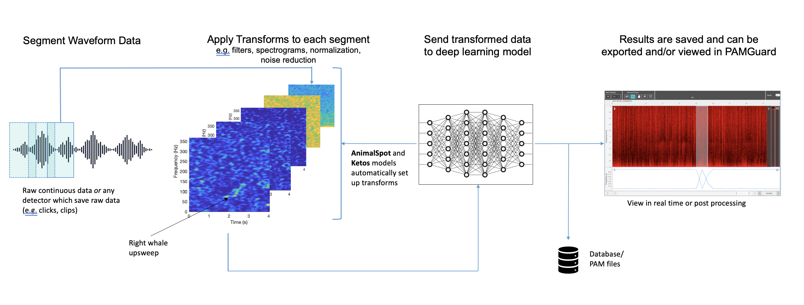

# PAMGuard's deep learning module

## Overview

PAMGuard's deep learning module allows users to deploy a large variety of deep learning models natively in PAMGuard. It is core module, fully integrated into PAMGuard's display and data management system and can be used in real time or for post processing data. It cna therfore be used as a classifier for almost anything and can integrate into multiple types of acoustic analysis workflows, for example post analysis analysis of recorder data or used as part of real time localisation workflow. 

## How it works

The deep learning module accepts raw data from different types of data sources, e.g. from the Sound Acquisition module, clicks and clips. It segments data into equal sized chunks with a specified overlap. Each chunk is passed through a set of transforms which convert the data into a format which is accepted by the specified deep learning model. These transforms are either manually set up by the user or, if a specific type of framework has been used to train a deep leanring model, then can be automatically set up by PAMGuard. Currently there are three implemented frameworks

  

_A diagram of how the deep learning module works in PAMGuard. An input waveform is segmented into chunks. A series of transforms are applied to each chunk creating the input for the deep learning model. The transformed chunks are sent to the model. The results from the model are saved and can be viewed in real time (e.g. mitigation) or in post processing (e.g. data from SoundTraps)._

### Generic Model
A generic model allows a user to load any model compatible with the djl (PyTorch (JIT), Tenserflow, ONXX)library and then manually set up a series of transforms using PAMGuard's transform library. It is recomended that users use an existing framework instead of a generic model as these models will automatically generate the required transforms. 

### AnimalSpot
[ANIMAL-SPOT](https://github.com/ChristianBergler/ANIMAL-SPOT) is a deep learning based framework which was initially designed for [killer whale sound detection]((https://github.com/ChristianBergler/ORCA-SPOT)) in noise heavy underwater recordings (see [Bergler et al. 2019](https://www.nature.com/articles/s41598-019-47335-w). It has now been expanded to a be species independent framework for training acoustic deep learning models using pytorch and python. Imported AnimalSpot model will automatically set up their own data transforms and output classes. 

### Ketos
[Ketos](https://meridian.cs.dal.ca/2015/04/12/ketos/) is an acoustic deep learning framework based on Tensorflow and developed by Meridian. It has excellent resources and tutorials and pytorch libraries can be installed easily via pip. Imported Ketos model will automatically set up their own data transforms and output classes. 

## Creating an instance of the module
The module can be added from the _File>  Add modules > Classifier > Raw deep learning classifier_ menu or by right clicking in the data model. More than one instance of the module can be added if multiple deep leanring models are required. 

## Module settings
The module settings are opened by selecting the  _Settings > Raw deep learning classifier_ menu. The main settings pane is shown below and is split into three sections, _Raw Sound Data_, _Segmentation_ and _Deep Learning Model_

  

_The main settings pane for the deep learning module with descriptions_

### Raw Sound Data

The deep learning module accepts any raw data source i.e. any data source that contains raw waveform data.

If the data is continous, e.g. from the Sound Acquisiiton module then deep leanring data units are saved to PAMGuard's datamanagement system if they pass a user defined prediciton threshold. The raw waveform data for segments whcih pass prediciton threshold is also saved. 

If the data source has already produced data units, e.g. clicks or clips, then the deep learning results are saved as annotation attached the data unit. The data is segmented in exactly the same way as continous data and thus, depending on the lenght of raw data, there can be more than one prediciton per dat unit.

Channel grouping controls are used to arrnage channels into groups. Channels in the same group are saved togethe for downstream processes. So for example if channels 0 and 2 and are in a group then the raw waveform data from both channel 0 and 2 will be saved and can be used in downstream processes, e.g. for localisation. 

### Segmentation

The segmentation section defines how the raw data is segmented. Some deep learning models require a specific segment size and others can be run with different segment sizes. The _Window Length_ is the size of the segment in samples. The _Hop Length_ is the overlap (from the strat of the segment). A _Hop Length_ which is the same as the segment length means no overlap. If a prediciton passes threshold then the raw data from segments is saved to PAMGuard binary files. If concurrent segments pass a prediciton threshold then they are saved as one data unit. The _Max. re-merge_ is the maximum number of segments that can form a single data unit before a new data unit is created. 

### Deep Learning Model 

The deep learning model section is used to select the deep learning model. The user must select the framework the model is from the in drop down menu e.g. Generic model. Note that each model type has a unique user interface which then appears below the drop down menu, however, currently these all look fairly similar. 

All the model types require the user to first select a model file using the browse button (File icon). A wait icon will appear and the model will be loaded. if the model loading is successful then the filename of the model will appear (e.g.  saved_model.pb)

_Note: when you first load a model  be connected to the internet as PAMGuard will download the correcty libraries for your computer to open the speciifc model. On Windows machine these libraries are found in a hidden folder called ai.djl. in your user account folder._

Once the model has loaded there a some unique options depending on the currently selected framework. 

#### Generic Model

A generic model must be set up via the Advanced menu button. 

  

The _transforms_ tab in the advanced menu pane allows a user to set up a set of transforms. The + button adds a transforms and these can be dragged in order using the drag handles on the left of each transform. Each transform pane can be expanded to show transform specific settings. The bottoms of the advanced settings pane shows a preview of the data that will be input into the deep learning model, including the shape size. 

  

#### AnimalSpot and Ketos models

If using an AnimalSpot or Ketos model then all transforms are automatically set up. The transforms can be viewed and altered via the Advanced menu button but in the majority of cases these settings should not be used. It is advisiable to select "Use defualt segment length" to change the _Window length_ to the default for the selected model. Note that this is often necessary for Ketos models but usually not a requirement for AnimalSpot models. 

## Running
### Real time
I  real time the deep learning model runs automatically when priocessing starts. A warning will appear if there are issues with the model and/or it cannot cope with real time speeds. 

### Viewer Mode
The deep learning module can be re-run on _detector_ data (e.g. click or clip detections) in PAMGuard _viewer_ mode.Detections can be reclassified by selecting the _Settings > Raw Deep Learning Classifier > Reclassify detections_. Select the data range in the reprocessing dialog e.g. Loaded Data and select _Start_. Detections without a deep leanring annotation will have one added and detections with an exisiting annotation will have it overwritten. 

## Viewing and exporting results
Output from the deep learning module can be viewed in PAMGuard viewer mode, or extracted from binary files using MATLAB or R. 

### PAMGuard viewer mode
Detections form continous raw data are shown in the datagram in the same way as all data streams in PAMGuard. The Time base display FX is best way to view the data outputs from the deep learning algorithm. 

